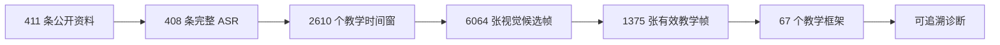
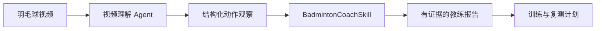

<p align="center">
  
</p>

<h1 align="center">BadmintonCoachSkill</h1>

<p align="center">
  <strong>Evidence-grounded badminton coaching intelligence for video agents.</strong><br>
  把公开教学内容转化为可追溯、可执行、可复测的羽毛球诊断知识。
</p>

<p align="center">
  
  
  
  
  
</p>

<p align="center">
  <a href="#see-the-reasoning">诊断示例</a> ·
  <a href="#built-from-coaching-content">构建数据</a> ·
  <a href="#coaching-system">教学体系</a> ·
  <a href="#quick-start">快速开始</a> ·
  <a href="#agent-integration">Agent 接入</a>
</p>

---

BadmintonCoachSkill 是一个面向羽毛球视频分析系统的专业教练知识层。

项目首个 Skill [`liu-hui-badminton-coach`](skills/liu-hui-badminton-coach/SKILL.md) 基于刘辉教练的公开教学资料构建。它接收学员画像和结构化视频观察，从 67 个学员适配与技术框架中选择训练方向，确定当前最优先的问题，并返回证据、纠正原则、训练动作和复测指标。

<a id="what-it-delivers"></a>
## What It Delivers

- 根据水平、身体条件、伤病风险和训练目标选择学员路径
- 诊断高远球、杀球、吊球、平抽挡、步法、反手和发接发
- 分析到位、击球点、顶肘、架拍、转髋、释放和回位
- 匹配球拍重量、挥重、平衡点、抗扭和中杆硬度
- 输出有优先级的纠正方案、训练动作和复测标准
- 为报告中的每个判断附加证据等级与置信边界

<a id="see-the-reasoning"></a>
## See The Reasoning

下面是一名初学者后场高远球的结构化观察：

```yaml
player:
  level: beginner
  goal: 将高远球稳定打到底线
  training_sessions_per_week: 3

observation:
  action: high_clear
  rear_court_arrival: late
  contact_point: behind_head
  elbow_height: low
  follow_through: short
```

Skill 生成的诊断核心：

```yaml
framework: late-arrival-recovery
top_priority: late-arrival

evidence:
  - 后场到位晚
  - 击球点移动到头后
  - 肘部结构在时间压力下下降

correction: 先重建到位节奏和身前击球窗口
drill: 后场到位定格练习
retest: 身后击球比例下降，击球后回位时间缩短
```

诊断顺序由动作前置条件决定：先处理到位和击球窗口，再进入架拍、动力链和释放速度训练。

<a id="built-from-coaching-content"></a>
## Built From Coaching Content

<table>
  <tr>
    <td align="center"><strong>411</strong><br>公开资料索引</td>
    <td align="center"><strong>408</strong><br>完整音频审阅视频</td>
    <td align="center"><strong>2610</strong><br>教学时间窗</td>
    <td align="center"><strong>2535</strong><br>ASR 确认窗口</td>
  </tr>
  <tr>
    <td align="center"><strong>6064</strong><br>视觉候选帧</td>
    <td align="center"><strong>1375</strong><br>有效教学帧</td>
    <td align="center"><strong>408</strong><br>重点时序序列</td>
    <td align="center"><strong>5304</strong><br>密集时序帧</td>
  </tr>
</table>



6064 张候选画面经过人物与球拍可见性、动作信息量、主体大小、清晰度、主题匹配和窗口内重复度审查，最终保留率为 **22.7%**。

204 条重点视频进入密集时序处理，共形成 408 个动作序列和 5304 张时序帧，用于观察准备、身体结构变化、支撑状态和动作阶段之间的二维变化。

<a id="coaching-system"></a>
## Coaching System

| 知识层 | 数量 |
|---|---:|
| 学员适配与技术框架 | **67** |
| 确定性诊断规则 | **50** |
| 语料审阅与证据边界 | **44** |
| 视觉证据规范 | **10** |
| 针对性训练方法 | **30** |
| 可执行训练计划 | **8** |

### 技术覆盖

`high clear` · `smash` · `drop` · `drive` · `rear footwork` · `front footwork` · `backhand` · `serve & receive` · `doubles` · `match transfer` · `equipment fit` · `safety & load`

体系覆盖：

- 后场到位、击球窗口和稳定头顶框架
- 顶肘、架拍、持拍侧结构和挥拍路径
- 转髋、躯干传导、手指释放和内旋代理指标
- 基础杀球、重杀、点杀、跳杀及不同杀球框架
- 吊球、劈吊、滑板、切球和头顶变化
- 前后场步法、衔接、回位和比赛压力迁移
- 平抽挡、接杀、发接发和前两拍处理
- 球拍静态重量、挥重、平衡点、抗扭和中杆硬度适配

### 学员适配

框架选择会综合：

- 当前水平与协调模式
- 身体活动度和风险因素
- 已经具备的动作前置条件
- 训练目标和可投入时间
- 到位、平衡、击球点和回位表现
- 器材与身体条件的匹配程度

<a id="evidence-first"></a>
## Evidence First

每一条来源支持的建议都可以沿着同一条证据链回溯：

```text
公开来源
  -> ASR 教学时间窗
  -> 可见动作时间戳
  -> 可选的时序 Pose 序列
  -> 学员适配框架
  -> 诊断规则
  -> 纠正原则
  -> 训练动作
  -> 复测指标
```

Skill 使用不同证据等级表达判断强度：

- `source_backed`：公开来源直接支持
- `asr_timestamp_reviewed_public_safe`：经过审阅的语音内容与时间戳
- `visual_model_structured_candidate_public_safe`：结构化单帧可见性证据
- `temporal_pose_proxy_public_safe`：二维时序人体结构代理证据
- `inferred`：多个公开来源的综合归纳
- `hypothesis`：等待进一步观察验证的诊断假设
- `insufficient_evidence`：当前观察需要补充机位、阶段或关键点

单帧证据用于描述人物、球拍、姿态和画面可见性；时序 Pose 用于描述粗粒度二维结构变化；接触时刻、拍面、握拍压力、真实关节旋转和三维动力学判断会附带明确的置信边界。

<a id="quick-start"></a>
## Quick Start

```bash
git clone https://github.com/jhxu003/BadmintonCoachSkill.git
cd BadmintonCoachSkill
python3 -m pip install -e .
python3 examples/run_usage_case.py
```

输出从下面的诊断信息开始：

```text
Primary framework: stable-overhead-frame
Top priority: late-arrival
```

运行全部内置场景：

```bash
python3 examples/run_full_system_cases.py
```

输入示例位于 [`examples/observations/`](examples/observations/)，数据结构定义位于：

- [`schemas/player-profile.schema.json`](schemas/player-profile.schema.json)
- [`schemas/video-observation.schema.json`](schemas/video-observation.schema.json)

<a id="agent-integration"></a>
## Agent Integration



```python
from pathlib import Path
from badminton_coach_skill.rubric_loader import load_skill_knowledge
from badminton_coach_skill.issue_matcher import match_diagnosis
from badminton_coach_skill.report_compiler import compile_llm_context

knowledge = load_skill_knowledge(
    Path("skills/liu-hui-badminton-coach/references")
)

diagnosis = match_diagnosis(
    player_profile,
    video_observation,
    knowledge,
)

llm_context = compile_llm_context(diagnosis)
```

视频理解模块提供击球点、肘部高度、身体结构、转髋时序、步法到位和回位等观察；BadmintonCoachSkill 完成框架选择、问题排序、证据关联和训练建议编排。

## Repository Structure

```text
BadmintonCoachSkill/
├── skills/liu-hui-badminton-coach/
│   ├── SKILL.md
│   └── references/
│       ├── frameworks.yaml
│       ├── student-profiles.yaml
│       ├── *-rubric.yaml
│       ├── drills.yaml
│       ├── training-plans.yaml
│       └── multimodal-evidence-map.yaml
├── src/badminton_coach_skill/
├── schemas/
├── examples/
├── data/corpus/
└── docs/
```

## Project Scope

项目性质：基于公开教学资料构建的独立研究 Skill。`liu-hui-badminton-coach` 的官方授权状态为未授权，项目内容代表本项目的资料整理和原创归纳。

当前完成性统计范围为项目已索引且可公开访问的非 YouTube B 站资料。公开仓库保存原创总结、框架、规则和证据元数据；视频、音频、完整字幕、模型原始输出、Pose 坐标和付费课程内容保存在公开仓库之外。

涉及疼痛、伤病与训练风险时，诊断报告应结合专业教练或医疗人员的评估。

详细资料状态与证据规则：

- [`data/corpus/collection-status.md`](data/corpus/collection-status.md)
- [`docs/content-video-pipeline.md`](docs/content-video-pipeline.md)
- [`skills/liu-hui-badminton-coach/references/corpus-provenance.md`](skills/liu-hui-badminton-coach/references/corpus-provenance.md)

---

<p align="center">
  <strong>Build badminton feedback that explains the diagnosis and measures the improvement.</strong>
</p>
