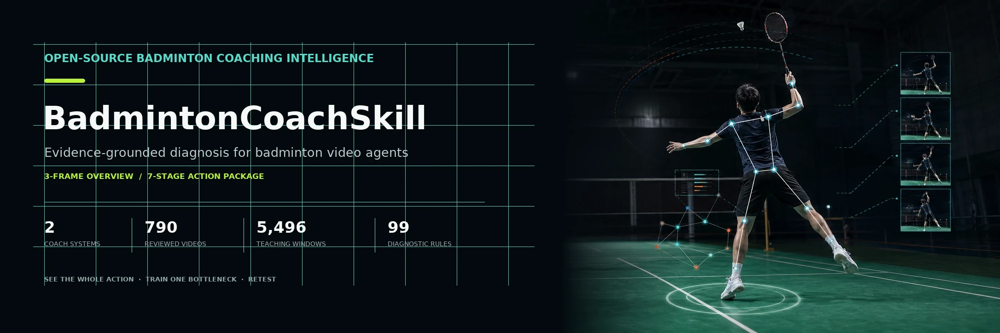
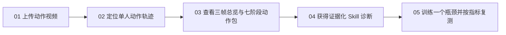
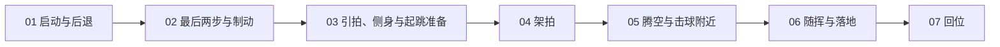
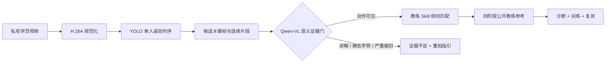

<p align="center">
  
</p>

<h1 align="center">BadmintonCoachSkill</h1>

<p align="center">
  <strong>把一段动作视频，变成可复查的教练证据链。</strong><br>
  <sub>EVIDENCE-GROUNDED BADMINTON COACHING INTELLIGENCE</sub>
</p>

<p align="center">
  上传一段动作视频。看完整动作，而不是只看三个瞬间。<br>
  证据不足就不下结论。获得教练对照、训练动作和复测标准。
</p>

<p align="center">
  
  
  
  
  
</p>

<p align="center">
  <a href="#experience">产品体验</a> ·
  <a href="#deliverables">诊断结果</a> ·
  <a href="#coaches">教练体系</a> ·
  <a href="#evidence">证据规模</a> ·
  <a href="#web-app">视频网页</a> ·
  <a href="#quick-start">快速开始</a> ·
  <a href="#agent-integration">Agent 接入</a>
</p>

---

BadmintonCoachSkill 是羽毛球视频分析 Agent 的**教练知识层与证据层**。它不把视频模型的一句描述直接包装成建议，而是把可见动作、教练规则、公开来源、纠正练习和复测指标连接成一条可以检查的诊断路径。

> **三帧负责定位，七阶段负责理解，Skill 负责诊断。** 任何阶段只要机位、动作连续性或画面可见性不足，系统就保留“不知道”，并告诉学员该怎么重拍。

<a id="experience"></a>

## 01 · 一段视频，五步进入训练闭环

<sub>PRODUCT EXPERIENCE</sub>



| 步骤 | 学员看到什么 | 系统在做什么 |
|---|---|---|
| **01 / 上传** | 选择教练体系和动作类型，上传一段连续动作视频 | 流式写入私有存储，并创建带一次性访问令牌的分析任务 |
| **02 / 定位** | 实时查看规范化、姿态分析和诊断进度 | 规范化 H.264 视频，跟踪一名可见学员，建立二维时序代理 |
| **03 / 复盘** | 三帧动作总览 + 从启动到回位的七阶段连续片段 | 三帧只用于快速定位；每个阶段片段约 0.8 秒，缺失画面不会被重复帧填充 |
| **04 / 对照** | 优先问题、学员证据、同阶段教练参考、置信边界 | Qwen-VL 先过滤讲解、手势和无效画面，再由教练 Skill 匹配规则和公开来源 |
| **05 / 训练** | 一次只改一个关键变量，获得训练剂量和复测指标 | 将诊断绑定到练习与下一次可观察、可比较的检查项 |

<a id="deliverables"></a>

## 02 · 一次分析，不只交付三张图

<sub>DIAGNOSTIC DELIVERABLES</sub>

三帧动作总览是导航，不是完整教学。真正的动作复盘沿一条连续时间线展开：



每个报告围绕五类结果组织：

| 结果 | 用途 | 证据边界 |
|---|---|---|
| **三帧动作总览** | 快速定位动作前、动作峰值附近和动作后的关键画面 | 只作索引；不能替代连续动作判断 |
| **七阶段私有动作包** | 按顺序播放启动、到位、挥拍、落地与回位，每段约 0.8 秒 | 阶段没有本地姿态支持时直接缺失，不借用邻近动作 |
| **Skill 优先诊断** | 排序当前最影响表现的动作问题，并说明可见事实 | 仅使用通过语义门控的画面；证据不足时返回重拍建议 |
| **同阶段教练对照** | 将学员片段与匹配的公开教练参考帧或片段并排查看 | 参考媒体只在诊断需要时进入部署私有缓存，并保留原平台时间点链接 |
| **训练与复测** | 给出纠正目标、训练动作、剂量和下一次视频检查项 | 一次优先改变一个变量，避免把多个问题混成一句泛化建议 |

例如，后场高远球打不远时，系统不会直接说“加大手腕发力”。它会先检查启动是否晚、最后两步是否失去节奏、身体是否及时转身、击球窗口是否落到头后、架拍是否来得及建立，再决定本次训练重点。

<a id="coaches"></a>

## 03 · 两套教练体系，两条诊断路径

<sub>COACH SYSTEMS</sub>

| 体系 | 更擅长回答 | 适合场景 | 证据规模 |
|---|---|---|---:|
| [**刘辉教练 Skill**](skills/liu-hui-badminton-coach/SKILL.md) | 这个学员该采用哪种动作框架、发力路线和训练选择？ | 学员适配、发力框架、步法、杀球变化、器材匹配与实战迁移 | 408 个已审视频 · 2,610 个教学时间窗 |
| [**李宇轩教练 Skill**](skills/li-yuxuan-badminton-coach/SKILL.md) | 从来球信号到回位，时间预算在哪个阶段被消耗了？ | 高远球、后场步法、杀球、平抽挡、发接发、双打与训练递进 | 382 个已审视频 · 2,886 个教学时间窗 |

李宇轩体系默认先处理时间与到位，再进入手臂、手腕或速度训练：

```text
对手击球 / 喂球信号
  → 启动与第一步
  → 到位、转身与调整步
  → 击球窗口
  → 顶肘与架拍
  → 躯干带动与释放
  → 落地、退出与回位
```

两套 Skill 都会根据学员基础、训练目标、移动能力、疼痛风险和可复测条件选择路径，而不是给所有人套用同一套标准动作。

<a id="evidence"></a>

## 04 · 证据规模，不等于模型自信

<sub>EVIDENCE DASHBOARD</sub>

<table>
  <tr>
    <td align="center"><strong>2</strong><br><sub>教练体系</sub></td>
    <td align="center"><strong>790</strong><br><sub>已审公开视频</sub></td>
    <td align="center"><strong>5,496</strong><br><sub>教学时间窗</sub></td>
    <td align="center"><strong>99</strong><br><sub>确定性诊断规则</sub></td>
  </tr>
</table>

| 体系 | 公开资料索引 | 已审视频 | 教学时间窗 | 视觉来源 | 时序序列 |
|---|---:|---:|---:|---:|---:|
| 刘辉 | 411 | 408 | 2,610 | 402 | 408 |
| 李宇轩 | 391 | 382 | 2,886 | 369 | 611 |

| 知识层 | 刘辉 | 李宇轩 | 合计 |
|---|---:|---:|---:|
| 学员适配与技术框架 | 67 | 32 | 99 |
| 确定性诊断规则 | 50 | 49 | 99 |
| 针对性训练动作 | 30 | 17 | 47 |
| 训练计划 | 8 | 3 | 11 |

李宇轩体系另包含 **6,240 张结构化视觉审阅帧**和 **7,943 张密集时序 Pose 帧**。这些材料只聚合为公开安全的来源级证据；仓库不包含原视频、音频、完整转写、截图、Pose 坐标或模型原始输出。

<a id="how-it-works"></a>

## 05 · 先过证据门，再进入诊断

<sub>HOW IT WORKS</sub>



证据层会明确区分四种来源状态：

- `asr_timestamp_reviewed_public_safe`：已审教学主题和时间戳定位。
- `visual_model_structured_candidate_public_safe`：单帧人物、球拍、姿态和可见性判断。
- `temporal_pose_proxy_public_safe`：密集单目 Pose 的粗粒度二维变化与序列定位。
- `insufficient_evidence`：当前机位、阶段或连续性不足，不生成确定性结论。

普通单目视频不会被用于声称真实内旋、握拍压力、拍面角度、精确羽毛球接触、力量大小或标定三维运动学。涉及疼痛、伤病和训练负荷时，系统只提供保守边界，不替代医疗评估。

<a id="web-app"></a>

## 06 · 可运行的视频证据网页

<sub>VIDEO EVIDENCE WEB APP</sub>

网页端提供从上传到删除的完整闭环：任务进度、三帧总览、七阶段动作包、优先纠正项、同阶段教练对照、训练剂量、复测指标和主动删除入口。

### 私有媒体边界

| 机制 | 行为 |
|---|---|
| **一次性访问令牌** | 创建任务时只返回一次；报告、学员帧、教练缓存媒体、删除请求和 WebSocket 都要求任务令牌 |
| **私有响应** | 学员与教练媒体接口返回 `private, no-store`；原始上传视频不会通过关键帧接口暴露 |
| **24 小时 TTL** | 上传、规范化视频、关键帧和中间媒体默认在 24 小时后清理；也可在页面立即删除 |
| **按需教练缓存** | 只下载已匹配的公开来源，提取所需参考媒体后删除临时源文件 |
| **明确过期状态** | 已过期任务和媒体返回 HTTP `410 Gone`，不会静默复用旧文件 |
| **发布隔离** | Git 不包含上传媒体、参考帧缓存、数据库、日志、访问令牌或模型原始输出 |

HTTP 接口、GPU / Celery 部署和全部环境变量见 [视频网页部署文档](docs/video-evidence-web-app.md)。

<a id="quick-start"></a>

## 07 · 快速开始

<sub>QUICK START</sub>

### 只运行教练 Skill

```bash
git clone https://github.com/jhxu003/BadmintonCoachSkill.git
cd BadmintonCoachSkill
python3 -m pip install -e .
```

运行李宇轩体系的后场高远球示例：

```bash
python3 examples/run_usage_case.py \
  --coach li-yuxuan \
  --observation examples/observations/li_yuxuan_rear_clear_timing.json
```

切换到刘辉体系：

```bash
python3 examples/run_usage_case.py --coach liu-hui
```

更多结构化输入位于 [`examples/observations/`](examples/observations/)，字段约束见 [`schemas/video-observation.schema.json`](schemas/video-observation.schema.json)。

### 在 GPU 主机运行视频网页

要求 Python 3.10+、Node.js 20+、NVIDIA CUDA GPU 和 FFmpeg。

```bash
conda env create -f environment-video.yml
conda activate badminton-video
python -m pip install -e .
npm --prefix web ci
```

启动 API：

```bash
export BADMINTON_PROJECT_ROOT="$PWD"
export BADMINTON_RUNTIME_ROOT="$HOME/.cache/badminton-coach-runtime"
export BADMINTON_POSE_MODEL_PATH="/models/yolo11n-pose.pt"
export BADMINTON_VLM_MODEL_PATH="/models/qwen-vl"
uvicorn badminton_coach_skill.web.app:create_app --factory --host 0.0.0.0 --port 8000
```

另开终端启动网页：

```bash
npm --prefix web run dev -- --host 0.0.0.0
```

模型路径可以不设置，默认标识位于 [`configs/video-analysis.yaml`](configs/video-analysis.yaml)。离线服务器或共享 GPU 集群建议指向预下载的 YOLO 权重和 Qwen-VL 目录，避免在处理上传视频时临时下载模型。

<a id="agent-integration"></a>

## 08 · 把 Skill 接到你的 Video Agent

<sub>AGENT INTEGRATION</sub>

```python
from pathlib import Path

from badminton_coach_skill.coach_registry import load_coach_knowledge
from badminton_coach_skill.issue_matcher import match_diagnosis
from badminton_coach_skill.report_compiler import compile_llm_context

knowledge = load_coach_knowledge("li-yuxuan", Path("."))
diagnosis = match_diagnosis(player_profile, video_observation, knowledge)
llm_context = compile_llm_context(diagnosis)
```

将 `li-yuxuan` 改为 `liu-hui` 即可切换体系。视频 Agent 负责输出可观察的结构化事实；Skill 负责规则、优先级、练习、证据等级和复测指标；LLM 只负责把受约束的 `llm_context` 编排成面向学员的解释。

- 输入契约：[Video Agent Contract](docs/video-agent-contract.md)
- 标注规范：[Annotation Guide](docs/annotation-guide.md)
- 诊断输出结构：[`schemas/diagnosis.schema.json`](schemas/diagnosis.schema.json)
- 教练 Skill：[刘辉](skills/liu-hui-badminton-coach/SKILL.md) · [李宇轩](skills/li-yuxuan-badminton-coach/SKILL.md)

<a id="scope"></a>

## 09 · 项目边界

<sub>SCOPE & BOUNDARIES</sub>

这是基于公开教学资料构建的独立研究项目。两个 Skill 提供来源边界、诊断规则、训练建议与复测结构，但不代表教练本人审阅、认可或授权任何个体诊断。付费课程仅用于记录公开目录边界，不被下载、转写或用于技术内容提炼。

仓库只发布可审查的代码、配置、Schema、示例和公开安全知识资产。完整法律与数据边界见 [`docs/legal-boundaries.md`](docs/legal-boundaries.md)。

<p align="center">
  <strong>Explain the evidence. Train one bottleneck. Measure the next improvement.</strong>
</p>
