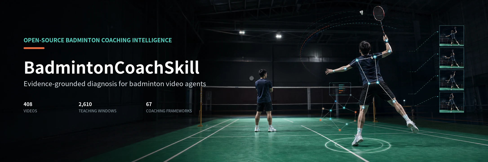
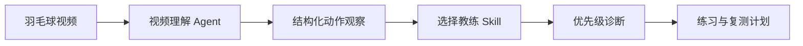

<p align="center">
  
</p>

<h1 align="center">BadmintonCoachSkill</h1>

<p align="center">
  <strong>Evidence-grounded badminton coaching systems for video agents.</strong><br>
  把结构化视频观察转化为可追溯的技术诊断、训练动作与复测指标。
</p>

<p align="center">
  
  
  
  
  
</p>

<p align="center">
  <a href="#coach-systems">教练体系</a> ·
  <a href="#from-video-to-plan">诊断路径</a> ·
  <a href="#evidence-scale">数据规模</a> ·
  <a href="#quick-start">快速开始</a> ·
  <a href="#video-evidence-web-app">视频诊断网页</a> ·
  <a href="#agent-integration">Agent 接入</a>
</p>

---

BadmintonCoachSkill 是羽毛球视频分析 Agent 的教练知识层。视频模型或人工标注先把视频转成结构化观察，例如启动时机、到位、击球点、顶肘、准备框架、释放、落地和回位；Skill 再选择适合该学员的诊断路径，给出优先级、证据、练习和复测标准。

## Coach Systems

| Skill | 核心能力 | 适用场景 | 公开语料规模 |
|---|---|---|---:|
| [`liu-hui-badminton-coach`](skills/liu-hui-badminton-coach/SKILL.md) | 学员适配、发力框架、步法、杀球变化、器材匹配与实战迁移 | 希望在动作框架、发力路线和训练计划之间做个体化选择 | 408 已审公开视频 |
| [`li-yuxuan-badminton-coach`](skills/li-yuxuan-badminton-coach/SKILL.md) | 从启动信号到到位、击球、准备、释放、回位的时间预算诊断 | 高远球、后场步法、杀球、平抽挡、发接发、双打与训练递进 | 382 已审公开视频 |

### 李宇轩体系的诊断顺序

```text
对手击球/喂球信号
  -> 启动与第一步
  -> 到位、转身与调整步
  -> 击球窗口
  -> 顶肘与架拍
  -> 躯干带动与释放
  -> 落地、退出与回位
```

这一路径优先处理时间与到位问题，再进入手臂、手腕或速度训练。它也会根据学员基础、训练目标、移动能力、疼痛风险和可复测条件选择训练路线，而不是把同一套动作要求套给所有人。

## From Video To Plan



每次诊断都围绕同一套输出结构：

1. 选择最匹配的学员路径和技术框架。
2. 排序当前最影响表现的动作问题。
3. 说明观察到的证据、适用边界和缺失机位。
4. 给出一次只改变一个关键变量的纠正原则与练习。
5. 定义下一次视频中可以检查的复测指标。

例如，后场高远球打不远时，系统不会直接要求“加大手腕发力”。它会先检查启动是否晚、是否及时转身、是否有调整步、击球是否落到头后、顶肘和架拍是否来得及建立，再决定训练重点。

## Evidence Scale

<table>
  <tr>
    <th align="left">体系</th>
    <th align="right">公开资料索引</th>
    <th align="right">已审视频</th>
    <th align="right">教学时间窗</th>
    <th align="right">视觉来源</th>
    <th align="right">时序序列</th>
  </tr>
  <tr>
    <td>刘辉</td>
    <td align="right">411</td>
    <td align="right">408</td>
    <td align="right">2,610</td>
    <td align="right">402</td>
    <td align="right">408</td>
  </tr>
  <tr>
    <td>李宇轩</td>
    <td align="right">391</td>
    <td align="right">382</td>
    <td align="right">2,886</td>
    <td align="right">369</td>
    <td align="right">611</td>
  </tr>
</table>

李宇轩体系还包含 6,240 张结构化视觉审阅帧和 7,943 张密集时序 Pose 帧。它们被聚合为公开安全的来源级证据，不包含视频、音频、完整转写、截图、Pose 坐标或模型原始输出。

| 知识层 | 刘辉 | 李宇轩 |
|---|---:|---:|
| 学员适配与技术框架 | 67 | 32 |
| 确定性诊断规则 | 50 | 49 |
| 针对性训练动作 | 30 | 17 |
| 训练计划 | 8 | 3 |

## Evidence Boundaries

Skill 会明确区分来源路由、可见条件和可验证的时间序列变化。

- `asr_timestamp_reviewed_public_safe` 用于已审教学主题和时间戳定位。
- `visual_model_structured_candidate_public_safe` 用于单帧中人物、球拍、姿态和画面可见性的结构化判断。
- `temporal_pose_proxy_public_safe` 用于密集单目 Pose 的粗粒度二维变化与序列定位。
- `insufficient_evidence` 表示当前机位、阶段或可见条件不足，需要补拍。

普通单目视频不会被用于声称真实内旋、握拍压力、拍面角度、羽毛球接触、力量大小或标定三维运动学。涉及疼痛、伤病和训练负荷时，系统只提供保守的训练边界，不替代医疗评估。

## Quick Start

```bash
git clone https://github.com/jhxu003/BadmintonCoachSkill.git
cd BadmintonCoachSkill
python3 -m pip install -e .
```

运行李宇轩体系的后场高远球示例：

```bash
python3 examples/run_usage_case.py \
  --coach li-yuxuan \
  --observation examples/observations/li_yuxuan_rear_clear_timing.json
```

运行刘辉体系的示例：

```bash
python3 examples/run_usage_case.py --coach liu-hui
```

输入示例位于 [`examples/observations/`](examples/observations/)。视频 Agent 只需输出与示例相同的结构化字段，即可调用对应 Skill。

## Video Evidence Web App

项目包含一个可运行的视频证据诊断网页：上传一段动作视频，选择教练体系和动作类型后，服务会在 GPU 上依次完成视频规范化、单人姿态轨迹、候选相位帧、Qwen-VL 语义门控、Skill 诊断和同阶段公开教练参考匹配。页面展示学员关键帧、对应的公开教练参考帧与原平台时间点链接。

视频服务需要运行在具备 CUDA 的主机上。建议使用 Conda 环境：

```bash
conda env create -f environment-video.yml
conda activate badminton-video
python -m pip install -e .
npm --prefix web ci
```

在 GPU 主机启动 API：

```bash
export BADMINTON_PROJECT_ROOT="$PWD"
export BADMINTON_RUNTIME_ROOT="$HOME/.cache/badminton-coach-runtime"
export BADMINTON_VLM_MODEL_PATH="/models/qwen-vl"
uvicorn badminton_coach_skill.web.app:create_app --factory --host 0.0.0.0 --port 8000
```

`BADMINTON_VLM_MODEL_PATH` 是可选项。未设置时，服务使用 [`configs/video-analysis.yaml`](configs/video-analysis.yaml) 中的 Qwen-VL 模型标识；在离线服务器或共享 GPU 集群中，建议将其指向预先下载的本地模型目录。

另开一个终端启动网页：

```bash
VITE_API_BASE=http://127.0.0.1:8000 npm --prefix web run dev -- --host 0.0.0.0
```

生产部署可设置 `BADMINTON_DISPATCH_MODE=celery` 和 `CELERY_BROKER_URL`，由独立 GPU Worker 执行推理；本地模式由 API 进程内的单线程任务队列执行。完整的运行边界、接口和部署变量见 [`docs/video-evidence-web-app.md`](docs/video-evidence-web-app.md)。

学员上传的视频、归一化视频、关键帧和中间媒体默认在 24 小时后删除，也可通过删除分析任务立即删除。公开教练参考帧只按诊断需要临时物化到部署私有缓存，Git 仓库不包含任何原始视频、截图、模型输出或学员媒体。

## Agent Integration

```python
from pathlib import Path

from badminton_coach_skill.coach_registry import load_coach_knowledge
from badminton_coach_skill.issue_matcher import match_diagnosis
from badminton_coach_skill.report_compiler import compile_llm_context

knowledge = load_coach_knowledge("li-yuxuan", Path("."))
diagnosis = match_diagnosis(player_profile, video_observation, knowledge)
llm_context = compile_llm_context(diagnosis)
```

将 `li-yuxuan` 改为 `liu-hui`，即可切换教练体系。LLM 使用 `llm_context` 编排面向学员的解释；规则、练习、证据等级和复测指标保持由 Skill 控制，避免把视频模型的低置信度描述直接写成技术结论。

## Repository Structure

```text
BadmintonCoachSkill/
├── skills/
│   ├── liu-hui-badminton-coach/
│   └── li-yuxuan-badminton-coach/
├── src/badminton_coach_skill/
├── schemas/
├── examples/
├── data/
│   └── coaches/li-yuxuan/
└── docs/
```

## Scope

这是基于公开教学资料的独立研究项目。两个 Skill 都提供来源边界、诊断规则、训练建议与复测结构；它们不代表教练本人审阅、认可或授权的个体判断。付费课程仅用于记录公开目录边界，不被下载、转写或用于技术内容提炼。

<p align="center">
  <strong>Explain the diagnosis. Train one bottleneck. Measure the next improvement.</strong>
</p>
