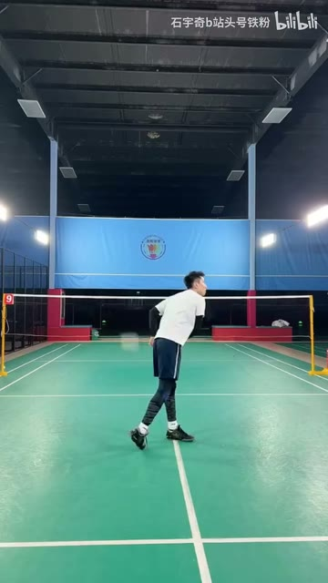
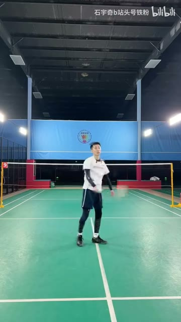
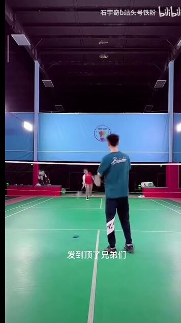
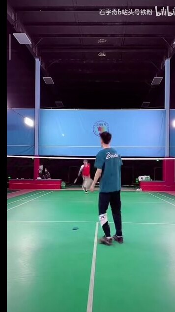
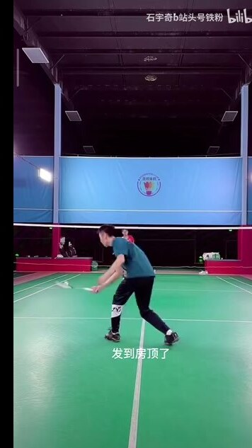
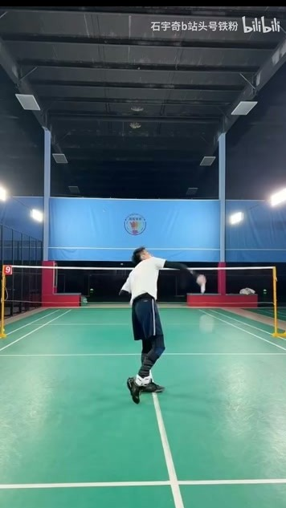
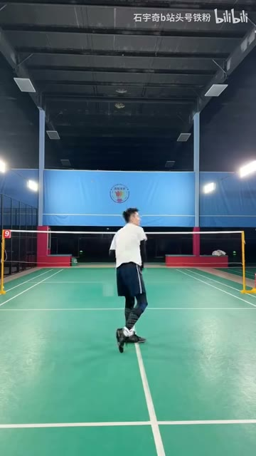
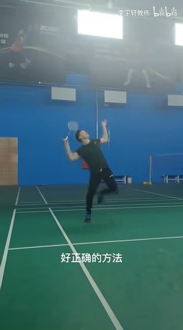
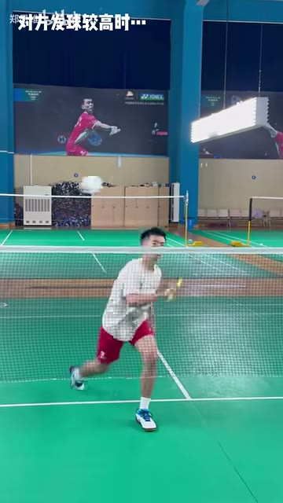

<p align="center">
  <a href="https://jhxu003.github.io/BadmintonCoachSkill/">
    
  </a>
</p>

<h1 align="center">BadmintonCoachSkill</h1>

<p align="center">
  <a href="README_CN.md">简体中文</a>
  &nbsp;·&nbsp;
  <strong>English</strong>
</p>

<p align="center">
  <strong>Turn complete badminton movements into lessons you can actually practice.</strong><br />
  Three coaching systems, continuous demonstrations, phase-by-phase guidance, and a clear next drill—connected in one learning path.
</p>

<p align="center">
  <a href="https://jhxu003.github.io/BadmintonCoachSkill/"><strong>Try the public lessons</strong></a>
  &nbsp;·&nbsp;
  <a href="#lessons"><strong>Browse 16 showcase lessons</strong></a>
  &nbsp;·&nbsp;
  <a href="#systems"><strong>Explore three coaching systems</strong></a>
</p>

<table align="center">
  <tr>
    <td align="center"><strong>03</strong><br /><sub>coaching systems</sub></td>
    <td align="center"><strong>873</strong><br /><sub>sources processed</sub></td>
    <td align="center"><strong>82</strong><br /><sub>source-linked topics</sub></td>
    <td align="center"><strong>16</strong><br /><sub>public showcase lessons</sub></td>
  </tr>
</table>

---

BadmintonCoachSkill turns public coaching material from three coaches into lessons that are easy to browse and practice. Each published lesson keeps one continuous demonstration together with seven ordered phases, technique cues, drills, and a measurable retest goal.

All 873 source videos have completed batch processing and title-only source routing into 82 coach-specific topics. Each topic now resolves to a bounded knowledge unit—frameworks, common-error rules, drills, retests, and exact source IDs—while its media remains unavailable until a same-source, same-topic context audit passes. GitHub Pages currently showcases 16 curated public lessons; those lessons are the public entry point, not the full processing output.

## One high clear, from preparation to recovery

The seven frames below come from one continuous high-clear demonstration by Coach Liu Hui. Follow the movement once, then open the clip and phase notes.

<table>
  <tr>
    <td width="14%" align="center"></td>
    <td width="14%" align="center"></td>
    <td width="14%" align="center"></td>
    <td width="14%" align="center"></td>
    <td width="14%" align="center"></td>
    <td width="14%" align="center"></td>
    <td width="14%" align="center"></td>
  </tr>
  <tr>
    <td align="center"><sub>01 Ready</sub></td>
    <td align="center"><sub>02 Start</sub></td>
    <td align="center"><sub>03 Arrive</sub></td>
    <td align="center"><sub>04 Structure</sub></td>
    <td align="center"><sub>05 Window</sub></td>
    <td align="center"><sub>06 Follow-through</sub></td>
    <td align="center"><sub>07 Recover</sub></td>
  </tr>
</table>

<p align="center">
  <a href="https://jhxu003.github.io/BadmintonCoachSkill/"><strong>Open the high-clear lesson</strong></a>
  &nbsp;·&nbsp;
  <a href="https://jhxu003.github.io/BadmintonCoachSkill/pages-demo/liu-hui-high-clear/action.mp4"><strong>Play the continuous action clip</strong></a>
</p>

<a id="experience"></a>

## How to use a lesson

<table>
  <tr>
    <td width="25%" valign="top"><strong>01 · Pick a system</strong><br /><sub>Enter one coach's learning route, then choose a technique.</sub></td>
    <td width="25%" valign="top"><strong>02 · Watch the full action</strong><br /><sub>See the movement from preparation through landing and recovery.</sub></td>
    <td width="25%" valign="top"><strong>03 · Study the phases</strong><br /><sub>Use seven keyframes to find the main observation point in each phase.</sub></td>
    <td width="25%" valign="top"><strong>04 · Return to court</strong><br /><sub>Practice with one clear goal, then check the result against a retest target.</sub></td>
  </tr>
</table>

<a id="systems"></a>

## Three coaches, three learning routes

<table>
  <tr>
    <td width="33%" align="center" valign="top">
      <a href="skills/liu-hui-badminton-coach/SKILL.md"></a><br />
      <strong>Liu Hui · 7 lessons</strong><br />
      <sub>Movement frameworks, rear-court variation, footwork, and fast exchanges</sub>
    </td>
    <td width="33%" align="center" valign="top">
      <a href="skills/li-yuxuan-badminton-coach/SKILL.md"></a><br />
      <strong>Li Yuxuan · 3 lessons</strong><br />
      <sub>Time and arrival, usable swing distance, and recovery after the shot</sub>
    </td>
    <td width="33%" align="center" valign="top">
      <a href="skills/zheng-siwei-badminton-coach/SKILL.md"></a><br />
      <strong>Zheng Siwei · 6 lessons</strong><br />
      <sub>Serve receive, front-back transitions, and readiness for the next shot</sub>
    </td>
  </tr>
</table>

| Coaching system | Primary learning question | Good starting points |
|---|---|---|
| [Liu Hui](skills/liu-hui-badminton-coach/SKILL.md) | How should movement structure, power routes, footwork, variations, and match transfer fit together? | High clear, smash, drop, rear-court footwork, drives, backhand, serve and receive |
| [Li Yuxuan](skills/li-yuxuan-badminton-coach/SKILL.md) | Where does the player run out of time between reading the shuttle, starting, arriving, and striking? | High clear, rear-court movement, drives, net lunge, and recovery |
| [Zheng Siwei](skills/zheng-siwei-badminton-coach/SKILL.md) | After this shot, is the pair still ready for the next exchange? | Serve receive, front-court links, rear-court attack, pressure retreat, and backhand transitions |

<a id="lessons"></a>

## 16 public showcase lessons

The public course page currently contains 16 curated lessons. Every lesson includes one continuous demonstration and seven ordered keyframes—112 phase images in total.

<details open>
<summary><strong>Liu Hui · 7 lessons</strong>　From rear-court structure to fast exchanges</summary>

| Lesson | What it teaches |
|---|---|
| Rear-court high clear | Arrival through full release |
| Heavy smash | Preparation, takeoff, landing, and the next shot |
| Slice drop | Similar preparation, rhythm change, and recovery |
| Rear-court attack footwork | China jump, landing, and exit |
| Drive exchange | Compact preparation, short swing, and rebound |
| Passive backhand | Entry, reach, handling, and recovery |
| Forehand high serve | Racket rotation, forward swing, and full release |
</details>

<details>
<summary><strong>Li Yuxuan · 3 lessons</strong>　Create time and arrival before adding swing speed</summary>

| Lesson | What it teaches |
|---|---|
| High clear | Creating time and usable swing distance |
| Drive exchange | Short preparation, early swing-through, and fast recovery |
| Net lunge | First response, arrival, and exit |
</details>

<details>
<summary><strong>Zheng Siwei · 6 lessons</strong>　Connect this shot to the next one</summary>

| Lesson | What it teaches |
|---|---|
| Receive cut to the body | Reading, entering the route, and preparing for the next shot |
| Left-court receive | Continue into the next exchange after the receive |
| Tight net drop | One continuous action linked to front-court pressure |
| Rear-court attack footwork | Movement, landing, and exit are all part of the action |
| Rear-court pressure retreat | Read, retreat, handle, and recover |
| Low backhand transition | Move, handle, and recover |
</details>

<p>
  <a href="https://jhxu003.github.io/BadmintonCoachSkill/"><strong>Open the public lesson library →</strong></a>
</p>

## Know what to practice next

The three coaching systems currently contain 31 connected curriculum nodes. Each node defines prerequisites, movement principles, drills, retest targets, and the next route. The wider source library is additionally organized into 82 source-linked teaching units (33 Liu Hui, 31 Li Yuxuan, and 18 Zheng Siwei): a named variation, situation, or question resolves to its own system route, sources, practice route, and retest. A topic unit cannot borrow media from another source or technique; it becomes video-ready only after exact private review.

| Current content | How to use it |
|---|---|
| 16 public lesson nodes | Watch the continuous demonstration and seven phases, then practice with the linked cues and retest goal. |
| 15 curriculum nodes | Learn the principles, drills, and progression now; matching public demonstrations will be added after review. |

## Explore the full source library

All 873 source videos have completed batch processing and source-linked topic routing: 408 from Liu Hui across 33 topics, 382 from Li Yuxuan across 31 topics, and 83 from Zheng Siwei across 18 topics. The course page preserves their original titles and platform links so you can continue into longer explanations, Q&A, and training material.

Use the two entry points differently: the **16 public showcase lessons** are ready for direct study, while the **873-source library** helps you explore more material by coach and technique.

<p>
  <a href="https://jhxu003.github.io/BadmintonCoachSkill/"><strong>Browse all content by coach and technique →</strong></a>
</p>

<details>
<summary><strong>View the full processing scale</strong></summary>

- All 873 sources completed the primary processing pass with zero failures.
- 407 sources produced at least one continuous-action candidate or ready package; 466 did not contain a sufficiently reliable continuous action.
- The private runtime contains 1,281 deduplicated action packages: 1,281 clips and 8,967 phase frames, all decode-validated.
- A source may contain several techniques and action episodes, so 1,281 packages do not mean 1,281 reviewed lessons.
- GitHub Pages currently publishes 16 curated lessons that completed content review and public-scope approval. All other results remain in the private review workflow.

</details>

<details>
<summary><strong>Video interpretation and teaching boundaries</strong></summary>

Ordinary monocular video cannot reliably establish exact shuttle contact, racket-face angle, true internal rotation, grip pressure, force magnitude, calibrated 3D kinematics, or opponent intent. When the view is insufficient, the system preserves uncertainty or recommends a better recording angle.

The three coaching systems are independently structured from public teaching material. They do not imply that the coaches personally reviewed, endorsed, or authorized an individual diagnosis.

</details>

## Developer quick start

```bash
git clone https://github.com/jhxu003/BadmintonCoachSkill.git
cd BadmintonCoachSkill
python3 -m pip install -e .

python3 examples/run_coach_demonstration.py \
  --coach liu-hui \
  --action high_clear \
  --phase top_elbow \
  --level beginner \
  --training-goal racket_frame
```

By default, the command returns a learning route, teaching principles, and timestamped source references without downloading media.

<details>
<summary><strong>Project data, deployment, and publication notes</strong></summary>

- [Public technique-course data](web/src/data/technique-courses.public.json)
- [Public source catalog](web/public/pages-demo/catalog.json)
- [Coach Skill source-topic indexes](skills/liu-hui-badminton-coach/references/source-topic-index.json)
- [Coach Skill topic teaching units](skills/liu-hui-badminton-coach/references/topic-teaching-units.json)
- [Video web application deployment](docs/video-evidence-web-app.md)
- [Video Agent contract](docs/video-agent-contract.md)
- [GitHub Pages and public media scope](docs/github-pages-demo.md)
- [Legal and data boundaries](docs/legal-boundaries.md)

Original videos, learner uploads, private runtime caches, model weights, databases, logs, tokens, and raw model output are not committed to the repository.

</details>
