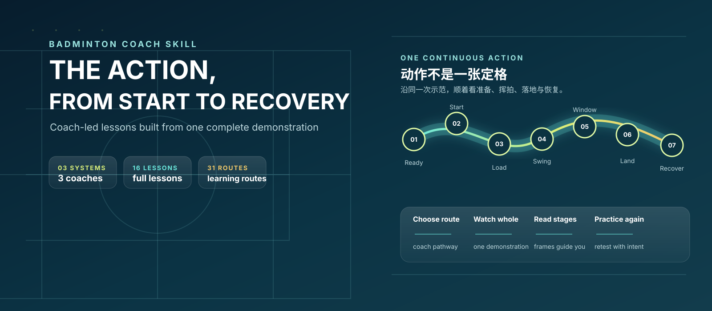

<p align="center">
  <a href="https://jhxu003.github.io/BadmintonCoachSkill/">
    
  </a>
</p>

<h1 align="center">BadmintonCoachSkill</h1>

<p align="center">
  <strong>把完整动作过程，整理成可以跟着练的课程。</strong><br />
  三位教练的技术体系、连续示范、阶段讲解与下一步练习，放在同一条学习路线里。
</p>

<p align="center">
  <a href="https://jhxu003.github.io/BadmintonCoachSkill/"><strong>体验公开课程</strong></a>
  &nbsp;·&nbsp;
  <a href="#课程"><strong>查看 16 节动作课</strong></a>
  &nbsp;·&nbsp;
  <a href="#体系"><strong>浏览三个体系</strong></a>
</p>

<table align="center">
  <tr>
    <td align="center"><strong>03</strong><br /><sub>教练体系</sub></td>
    <td align="center"><strong>16</strong><br /><sub>完整公开课程</sub></td>
    <td align="center"><strong>31</strong><br /><sub>技术路线节点</sub></td>
    <td align="center"><strong>112</strong><br /><sub>阶段关键帧</sub></td>
  </tr>
</table>

---

BadmintonCoachSkill 把三位教练的公开教学内容整理成可以直接浏览和练习的动作课程。每节课都把同一次示范的连续短片、七个动作阶段、技术要点、练习方法和复测目标放在一起。

你可以先选教练，再选技术；看完整动作，也知道这节课之前要会什么、练完以后可以继续学什么。

<a id="体验"></a>

## 一节动作课，按这四步看

| 你会做什么 | 你会看到什么 |
|---|---|
| 选择教练与技术路线 | 先进入一位教练的完整教学体系，再选择你要学习的动作。 |
| 观看连续示范 | 从准备一直看到落地和恢复，先建立对完整动作的认识。 |
| 沿七阶段细看 | 用关键帧找到准备、启动、加载、挥拍、动作窗口、落地和恢复。 |
| 回到场上练习 | 按课程给出的要点和练习方法训练，再用明确目标检查进步。 |

> **关键帧帮你看清位置，连续示范帮你理解动作。** 两者缺一不可。

<a id="课程"></a>

## 16 节可直接体验的动作课

公开课程页现有 16 节完整动作课。每节都有 1 段连续示范和 7 张有序阶段帧，共 112 张关键帧；你可以先看完整动作，再回到任一阶段阅读要点。

<details open>
<summary><strong>刘辉 · 7 节</strong>　从后场动作框架到快速交换</summary>

| 课程 | 这节课讲什么 |
|---|---|
| 后场高远球 | 从到位到完整释放 |
| 重杀 | 准备、起跳、落地与下一拍 |
| 滑板吊球 | 准备相似、节奏变化与回收 |
| 后场突击步法 | 中国跳、落地与退出 |
| 平抽挡 | 紧凑准备、短出拍与回弹 |
| 反手被动球 | 进入、伸展处理与恢复 |
| 正手发高远球 | 转拍、前摆与完整释放 |
</details>

<details>
<summary><strong>李宇轩 · 3 节</strong>　先解决时间与到位，再建立挥拍距离</summary>

| 课程 | 这节课讲什么 |
|---|---|
| 高远球 | 先创造时间和挥拍距离 |
| 平抽挡 | 短准备、早通过、快回收 |
| 网前跨步 | 第一步、到位与退出 |
</details>

<details>
<summary><strong>郑思维 · 6 节</strong>　双打中把这一拍接到下一拍</summary>

| 课程 | 这节课讲什么 |
|---|---|
| 接发切腰 | 读球、进入路线、准备下一拍 |
| 左半场接发 | 处理后继续进入下一拍 |
| 贴网吊球 | 一次连续动作与前场压力衔接 |
| 后场突击步法 | 移动、落地和退出都算动作 |
| 被压后场退步 | 读球、后退处理与恢复 |
| 反手低手位过渡 | 移动、处理与回收 |
</details>

<p>
  <a href="https://jhxu003.github.io/BadmintonCoachSkill/"><strong>打开公开课程库 →</strong></a>
</p>

<a id="体系"></a>

## 三个体系，三种学习重点

| 教练体系 | 先解决什么 | 适合从哪里开始 |
|---|---|---|
| [刘辉](skills/liu-hui-badminton-coach/SKILL.md) | 动作框架、发力路线、步法、变化与实战迁移之间如何选择 | 后场高远球、杀球、吊球、步法、平抽挡、反手、发接发 |
| [李宇轩](skills/li-yuxuan-badminton-coach/SKILL.md) | 从读球、启动、到位到出拍，时间在哪一段不够用 | 高远球、后场移动、平抽挡、网前跨步与回收 |
| [郑思维](skills/zheng-siwei-badminton-coach/SKILL.md) | 在双打连续交换中，处理这一拍后怎样让下一拍仍可用 | 接发、前场衔接、后场进攻、受压退步和反手过渡 |

## 不只看这一节，也知道下一节练什么

三个体系已经整理出 31 个相互衔接的技术节点。每个节点都会标明先修内容、动作原则、练习方法、复测目标和下一步路线。

| 当前内容 | 可以怎么用 |
|---|---|
| 16 个完整动作课节点 | 观看连续示范和七阶段帧，跟着技术要点、练习与复测目标学习。 |
| 15 个技术路线节点 | 先学习动作原理、练习和衔接关系；对应的完整示范仍在继续补充。 |

<a id="资料"></a>

## 继续探索更多内容

除了 16 节动作课，课程页还提供 873 条来源视频的浏览入口：刘辉 408 条、李宇轩 382 条、郑思维 83 条。这些视频按教练体系和技术类型分类，并保留原始标题与原平台链接，方便继续查找讲解、答疑和训练内容。

页面把内容分成两个入口：**完整动作课**适合直接跟练，**来源视频库**适合继续探索更多相关内容。

<p>
  <a href="https://jhxu003.github.io/BadmintonCoachSkill/"><strong>按教练和技术浏览全部内容 →</strong></a>
</p>

<a id="边界"></a>

<details>
<summary><strong>关于视频判断与教学边界</strong></summary>

普通单目视频不能可靠给出精确触球、拍面角度、真实内旋、握拍压力、力量大小、三维运动学或对手意图。画面不足时，系统会保留不确定性或建议补拍。

三位教练的知识体系来自公开教学资料的独立整理，不代表教练本人逐条审阅、认可或授权个体诊断。

</details>

<a id="本地使用"></a>

## 开发者使用

```bash
git clone https://github.com/jhxu003/BadmintonCoachSkill.git
cd BadmintonCoachSkill
python3 -m pip install -e .

python3 examples/run_coach_demonstration.py \
  --coach liu-hui \
  --action high_clear \
  --phase top_elbow \
  --level beginner \
  --training-goal racket_frame
```

默认输出技术路线、教学原则和带原平台时间点的参考信息，不下载媒体。

<details>
<summary><strong>项目数据、部署与发布说明</strong></summary>

- [技术课程结构数据](web/src/data/technique-courses.public.json)
- [公开视频目录数据](web/public/pages-demo/catalog.json)
- [视频网页部署文档](docs/video-evidence-web-app.md)
- [Video Agent 接入契约](docs/video-agent-contract.md)
- [公开 Demo 与媒体范围](docs/github-pages-demo.md)
- [法律与数据边界](docs/legal-boundaries.md)

原始视频、学员上传、私有运行时缓存、模型权重、数据库、日志、令牌与模型原始输出均不进入仓库。

</details>
