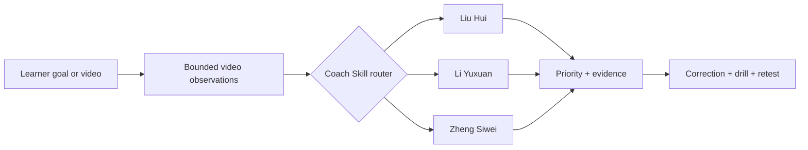

<p align="center">
  <a href="https://jhxu003.github.io/BadmintonCoachSkill/">
    
  </a>
</p>

<h1 align="center">BadmintonCoachSkill</h1>

<p align="center">
  <strong>Evidence-grounded badminton coaching Skills for complete movements—not isolated poses.</strong><br />
  Turn a learning goal or structured video observation into a coach-specific route, visible evidence, one drill, and a measurable retest.
</p>

<p align="center">
  <a href="https://jhxu003.github.io/BadmintonCoachSkill/"></a>
  <a href="https://github.com/jhxu003/BadmintonCoachSkill/actions/workflows/deploy-pages.yml"></a>
  <a href="pyproject.toml"></a>
  <a href="LICENSE"></a>
</p>

<p align="center">
  <a href="README_CN.md">简体中文</a>
  &nbsp;·&nbsp;
  <strong>English</strong>
</p>

<p align="center">
  <a href="https://jhxu003.github.io/BadmintonCoachSkill/"><strong>Open the live demo</strong></a>
  &nbsp;·&nbsp;
  <a href="#quick-start"><strong>Quick start</strong></a>
  &nbsp;·&nbsp;
  <a href="#coach-skills"><strong>Coach Skills</strong></a>
  &nbsp;·&nbsp;
  <a href="#how-the-agent-works"><strong>Agent workflow</strong></a>
</p>

---

BadmintonCoachSkill converts public coaching material into structured, bounded teaching knowledge. It keeps the entire learning chain connected:

```text
learning goal or learner video
              ↓
bounded visual observations
              ↓
coach-specific Skill routing
              ↓
visible issue → correction principle → drill → retest
```

The project does not treat one attractive frame as proof of a complete technique. A published lesson starts with one continuous action, then uses seven ordered frames only to navigate that same movement.

## What makes it useful

| | Capability | What you get |
|---|---|---|
| **01** | Three coach-specific Skills | Separate teaching systems for Liu Hui, Li Yuxuan, and Zheng Siwei instead of one blended coaching voice. |
| **02** | Evidence-linked recommendations | Every diagnosis connects observations, a framework, a correction, a drill, and a retest target. |
| **03** | Complete-action lessons | Continuous clips come before stage frames; preparation, action, landing, and recovery stay together. |
| **04** | Fail-closed media selection | A topic never borrows a clip from another technique. Missing evidence stays missing instead of becoming a confident claim. |

<table align="center">
  <tr>
    <td align="center"><strong>3</strong><br /><sub>coach Skills</sub></td>
    <td align="center"><strong>873</strong><br /><sub>sources indexed</sub></td>
    <td align="center"><strong>82</strong><br /><sub>source-linked topics</sub></td>
    <td align="center"><strong>31</strong><br /><sub>curriculum nodes</sub></td>
    <td align="center"><strong>16</strong><br /><sub>public lessons</sub></td>
  </tr>
</table>

<a id="public-demo"></a>

## See one movement from start to recovery

These seven frames belong to the same Liu Hui high-clear demonstration. Use them as navigation; use the continuous clip to understand the action.

<table>
  <tr>
    <td width="14%" align="center"></td>
    <td width="14%" align="center"></td>
    <td width="14%" align="center"></td>
    <td width="14%" align="center"></td>
    <td width="14%" align="center"></td>
    <td width="14%" align="center"></td>
    <td width="14%" align="center"></td>
  </tr>
  <tr>
    <td align="center"><sub>Ready</sub></td>
    <td align="center"><sub>Start</sub></td>
    <td align="center"><sub>Arrive</sub></td>
    <td align="center"><sub>Structure</sub></td>
    <td align="center"><sub>Window</sub></td>
    <td align="center"><sub>Follow-through</sub></td>
    <td align="center"><sub>Recover</sub></td>
  </tr>
</table>

<p align="center">
  <a href="https://jhxu003.github.io/BadmintonCoachSkill/"><strong>Explore all 16 public lessons</strong></a>
  &nbsp;·&nbsp;
  <a href="https://jhxu003.github.io/BadmintonCoachSkill/pages-demo/liu-hui-high-clear/action.mp4"><strong>Play this continuous action</strong></a>
</p>

<a id="quick-start"></a>

## Quick start

Install the Python package and query a coach teaching route:

```bash
git clone https://github.com/jhxu003/BadmintonCoachSkill.git
cd BadmintonCoachSkill
python3 -m pip install -e ".[test]"

python3 examples/run_coach_demonstration.py \
  --coach liu-hui \
  --action high_clear \
  --phase top_elbow \
  --level beginner \
  --training-goal racket_frame
```

Run a structured learner case:

```bash
python3 examples/run_usage_case.py \
  --coach liu-hui \
  --observation examples/observations/high_clear_late_arrival.json
```

The result ranks an observable priority and returns the supporting evidence, selected framework, correction direction, drill, and retest. Source media is not downloaded unless an explicitly approved runtime workflow requests it.

Run the public web experience locally:

```bash
npm --prefix web ci
npm --prefix web run dev
```

<a id="coach-skills"></a>

## Three coach Skills, three different questions

<table>
  <tr>
    <td width="33%" align="center" valign="top">
      <a href="skills/liu-hui-badminton-coach/SKILL.md"></a><br />
      <strong>Liu Hui</strong><br />
      <sub>Movement structures, power routes, variations, footwork, and match transfer</sub>
    </td>
    <td width="33%" align="center" valign="top">
      <a href="skills/li-yuxuan-badminton-coach/SKILL.md"></a><br />
      <strong>Li Yuxuan</strong><br />
      <sub>Reading time, starting, arriving, usable swing distance, and recovery</sub>
    </td>
    <td width="33%" align="center" valign="top">
      <a href="skills/zheng-siwei-badminton-coach/SKILL.md"></a><br />
      <strong>Zheng Siwei</strong><br />
      <sub>Serve receive, pair spacing, transitions, pressure, and readiness for the next shot</sub>
    </td>
  </tr>
</table>

| Skill | Best starting question | Coverage |
|---|---|---|
| [Liu Hui Badminton Coach](skills/liu-hui-badminton-coach/SKILL.md) | How should movement structure, power, footwork, and variation fit together? | High clear, smash, drop, drive, footwork, backhand, serve/receive, doubles, equipment, match transfer |
| [Li Yuxuan Badminton Coach](skills/li-yuxuan-badminton-coach/SKILL.md) | Where does the player run out of time before, during, or after the shot? | Overhead actions, rear/front movement, drive, receive, backhand, equipment and load-aware practice |
| [Zheng Siwei Mixed Doubles Coach](skills/zheng-siwei-badminton-coach/SKILL.md) | Is the pair still available for the next exchange after this shot? | Opening, front-court pressure, rear attack, rotation, defense transition, reset and partner coordination |

Each Skill can teach a reviewed action without learner video, or diagnose structured observations supplied by a human annotator or video-analysis agent.

<a id="how-the-agent-works"></a>

## How the agent works


```mermaid
flowchart LR
    A[Learner goal or video] --> B[Bounded video observations]
    B --> C{Coach Skill router}
    C --> D[Liu Hui]
    C --> E[Li Yuxuan]
    C --> F[Zheng Siwei]
    D --> G[Priority + evidence]
    E --> G
    F --> G
    G --> H[Correction + drill + retest]
```

1. **Observe:** extract only visible, timestamped facts and explicitly record missing views.
2. **Route:** select a coach Skill, learner-fit framework, action family, and curriculum node.
3. **Match:** connect the highest-priority observable issue to source-backed principles and rules.
4. **Coach:** return one correction, one drill, and a measurable retest before adding complexity.
5. **Stay bounded:** preserve uncertainty when ordinary monocular video cannot support a claim.

The [Video Agent contract](docs/video-agent-contract.md) defines the handoff between video analysis and coach diagnosis. The [web application guide](docs/video-evidence-web-app.md) describes the private learner-video workflow.

## Public library and private review

The public site contains **16 curated lessons**, each with one continuous clip and seven ordered frames. The wider source index contains **873 public source records** routed into **82 coach-specific topics**.

These numbers represent different stages:

| Layer | Status | Meaning |
|---|---|---|
| 873 source records | Indexed | Public titles and source links can route a teaching question. |
| 82 topic units | Knowledge-ready | Each topic resolves to a framework, rules, drills, retests, and exact source IDs. |
| 31 curriculum nodes | Structured | Prerequisites and next learning steps are connected. |
| 16 public lessons | Teaching-ready | Same-source review approved a continuous action and its seven stage frames for publication. |

Topic routing alone does not prove visible mechanics and never authorizes a clip from another action. Original videos, learner uploads, private caches, model weights, databases, logs, tokens, and raw model outputs are excluded from Git.

<details>
<summary><strong>View the 16 published lessons</strong></summary>

- **Liu Hui:** rear-court high clear, heavy smash, slice drop, rear-court attack footwork, drive exchange, passive backhand, forehand high serve.
- **Li Yuxuan:** high clear, drive exchange, net lunge.
- **Zheng Siwei:** receive cut to the body, left-court receive, tight net drop, rear-court attack footwork, rear-court pressure retreat, low backhand transition.

</details>

## Evidence boundaries

> [!IMPORTANT]
> Ordinary monocular video cannot reliably establish exact shuttle contact, racket-face angle, true internal rotation, grip pressure, force magnitude, calibrated 3D kinematics, or opponent intent. When evidence is insufficient, the system returns an uncertainty or recording recommendation instead of inventing precision.

This is a non-official public-source research project. It does not claim that Liu Hui, Li Yuxuan, or Zheng Siwei reviewed, endorsed, or authorized an individual diagnosis.

## Documentation

- [Public demo and media scope](docs/github-pages-demo.md)
- [Video Agent contract](docs/video-agent-contract.md)
- [Video evidence web application](docs/video-evidence-web-app.md)
- [Annotation guide](docs/annotation-guide.md)
- [Legal and data boundaries](docs/legal-boundaries.md)
- [Public technique-course data](web/src/data/technique-courses.public.json)
- [Public source catalog](web/public/pages-demo/catalog.json)

## Validation

```bash
python3 -m pytest -q
npm --prefix web run build
```

Current baseline: **90 Python tests** and a production Vite build covering **1,600 modules**.

## License

Released under the [MIT License](LICENSE). Public-source attribution and media-publication boundaries remain documented separately in [legal and data boundaries](docs/legal-boundaries.md).
