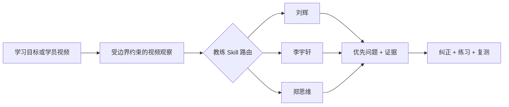

<p align="center">
  <a href="https://jhxu003.github.io/BadmintonCoachSkill/">
    
  </a>
</p>

<h1 align="center">BadmintonCoachSkill</h1>

<p align="center">
  <strong>面向完整动作、基于可见证据的羽毛球教练 Skills，而不是只看一张定格。</strong><br />
  把学习目标或结构化视频观察，转换为教练专属路线、可见证据、一个练习和可复测目标。
</p>

<p align="center">
  <a href="https://jhxu003.github.io/BadmintonCoachSkill/"></a>
  <a href="https://github.com/jhxu003/BadmintonCoachSkill/actions/workflows/deploy-pages.yml"></a>
  <a href="pyproject.toml"></a>
  <a href="LICENSE"></a>
</p>

<p align="center">
  <strong>简体中文</strong>
  &nbsp;·&nbsp;
  <a href="README.md">English</a>
</p>

<p align="center">
  <a href="https://jhxu003.github.io/BadmintonCoachSkill/"><strong>打开在线演示</strong></a>
  &nbsp;·&nbsp;
  <a href="#快速开始"><strong>快速开始</strong></a>
  &nbsp;·&nbsp;
  <a href="#三个教练-skill"><strong>教练 Skills</strong></a>
  &nbsp;·&nbsp;
  <a href="#agent-如何工作"><strong>Agent 流程</strong></a>
</p>

---

BadmintonCoachSkill 把公开教练内容整理成结构化、受证据边界约束的教学知识，并保持整条学习链路相互连接：

```text
学习目标或学员视频
        ↓
受边界约束的视觉观察
        ↓
教练专属 Skill 路由
        ↓
可见问题 → 纠正原则 → 练习 → 复测
```

项目不会把一张“看起来不错”的画面当作完整技术证明。每节公开动作课先展示一段连续动作，再用七张有序阶段帧定位同一次动作。

## 它解决什么问题

| | 能力 | 得到什么 |
|---|---|---|
| **01** | 三个教练专属 Skill | 刘辉、李宇轩、郑思维三套独立教学体系，不混成一个模糊的“综合教练口吻”。 |
| **02** | 建议与证据相连 | 每次诊断都连接观察、框架、纠正方向、练习和复测目标。 |
| **03** | 完整动作课程 | 先看连续动作，再看阶段帧；准备、动作、落地和恢复不会被拆散。 |
| **04** | 媒体选择失败即关闭 | 一个主题不能借用另一个技术的片段；没有证据时保留缺口，不强行下结论。 |

<table align="center">
  <tr>
    <td align="center"><strong>3</strong><br /><sub>教练 Skills</sub></td>
    <td align="center"><strong>873</strong><br /><sub>已索引来源</sub></td>
    <td align="center"><strong>82</strong><br /><sub>来源绑定主题</sub></td>
    <td align="center"><strong>31</strong><br /><sub>课程路线节点</sub></td>
    <td align="center"><strong>16</strong><br /><sub>公开动作课</sub></td>
  </tr>
</table>

<a id="公开演示"></a>

## 一次动作，从准备看到恢复

下面七张图来自刘辉教练同一次高远球示范。阶段帧用于定位动作，连续短片用于理解过程。

<table>
  <tr>
    <td width="14%" align="center"></td>
    <td width="14%" align="center"></td>
    <td width="14%" align="center"></td>
    <td width="14%" align="center"></td>
    <td width="14%" align="center"></td>
    <td width="14%" align="center"></td>
    <td width="14%" align="center"></td>
  </tr>
  <tr>
    <td align="center"><sub>准备</sub></td>
    <td align="center"><sub>启动</sub></td>
    <td align="center"><sub>到位</sub></td>
    <td align="center"><sub>高位结构</sub></td>
    <td align="center"><sub>动作窗口</sub></td>
    <td align="center"><sub>随挥</sub></td>
    <td align="center"><sub>恢复</sub></td>
  </tr>
</table>

<p align="center">
  <a href="https://jhxu003.github.io/BadmintonCoachSkill/"><strong>浏览全部 16 节公开动作课</strong></a>
  &nbsp;·&nbsp;
  <a href="https://jhxu003.github.io/BadmintonCoachSkill/pages-demo/liu-hui-high-clear/action.mp4"><strong>播放这段连续动作</strong></a>
</p>

<a id="快速开始"></a>

## 快速开始

安装 Python 包并查询一个教练教学路线：

```bash
git clone https://github.com/jhxu003/BadmintonCoachSkill.git
cd BadmintonCoachSkill
python3 -m pip install -e ".[test]"

python3 examples/run_coach_demonstration.py \
  --coach liu-hui \
  --action high_clear \
  --phase top_elbow \
  --level beginner \
  --training-goal racket_frame
```

运行一个结构化学员案例：

```bash
python3 examples/run_usage_case.py \
  --coach liu-hui \
  --observation examples/observations/high_clear_late_arrival.json
```

结果会排序最值得先处理的可见问题，并返回证据、选中的框架、纠正方向、练习和复测。除非进入经过明确批准的运行时流程，否则不会下载来源媒体。

在本地运行公开网页：

```bash
npm --prefix web ci
npm --prefix web run dev
```

<a id="三个教练-skill"></a>

## 三个教练 Skill，回答三类不同问题

<table>
  <tr>
    <td width="33%" align="center" valign="top">
      <a href="skills/liu-hui-badminton-coach/SKILL.md"></a><br />
      <strong>刘辉</strong><br />
      <sub>动作框架、发力路线、变化、步法与实战迁移</sub>
    </td>
    <td width="33%" align="center" valign="top">
      <a href="skills/li-yuxuan-badminton-coach/SKILL.md"></a><br />
      <strong>李宇轩</strong><br />
      <sub>读球时间、启动、到位、可用挥拍距离与回收</sub>
    </td>
    <td width="33%" align="center" valign="top">
      <a href="skills/zheng-siwei-badminton-coach/SKILL.md"></a><br />
      <strong>郑思维</strong><br />
      <sub>接发、双打站位、转换、压迫与下一拍准备</sub>
    </td>
  </tr>
</table>

| Skill | 最适合从什么问题开始 | 覆盖范围 |
|---|---|---|
| [刘辉羽毛球教练](skills/liu-hui-badminton-coach/SKILL.md) | 动作框架、发力、步法和变化应当怎样组合？ | 高远球、杀球、吊球、平抽挡、步法、反手、发接发、双打、装备与实战迁移 |
| [李宇轩羽毛球教练](skills/li-yuxuan-badminton-coach/SKILL.md) | 从出发到击球后回收，时间在哪一段不够用？ | 头顶动作、前后场移动、平抽挡、接发、反手、装备和负荷控制 |
| [郑思维混双教练](skills/zheng-siwei-badminton-coach/SKILL.md) | 处理这一拍后，两个人是否仍能衔接下一拍？ | 开局、前场压迫、后场进攻、轮转、防守转换、重置和搭档协作 |

每个 Skill 都能在没有学员视频时讲解已审核动作，也能诊断由人工标注者或视频分析 Agent 提供的结构化观察。

<a id="agent-如何工作"></a>

## Agent 如何工作



1. **观察：** 只提取画面中可见、带时间戳的事实，同时记录缺失机位和阶段。
2. **路由：** 选择教练 Skill、适合学员的框架、动作类别和课程节点。
3. **匹配：** 把最优先的可见问题连接到有来源支持的原则与规则。
4. **指导：** 先返回一个纠正方向、一个练习和一个可测复测，再增加复杂度。
5. **保持边界：** 普通单目视频不能支持的结论必须保留不确定性。

[Video Agent 协议](docs/video-agent-contract.md)定义视频分析与教练诊断之间的交接；[Web 应用说明](docs/video-evidence-web-app.md)描述私有学员视频工作流。

## 公开课程与私有审核

公开网站包含 **16 节精选课程**，每节都有一段连续动作和七张有序阶段帧。更大的来源索引包含 **873 条公开来源记录**，路由到 **82 个教练专属主题**。

这些数字代表不同阶段：

| 层级 | 状态 | 含义 |
|---|---|---|
| 873 条来源记录 | 已索引 | 公开标题与来源链接可用于路由教学问题。 |
| 82 个主题单元 | 知识就绪 | 每个主题都有框架、规则、练习、复测和精确来源 ID。 |
| 31 个课程节点 | 已结构化 | 前置技术和下一步学习路线已经连接。 |
| 16 节公开课程 | 教学就绪 | 同来源审核通过连续动作及其七张阶段帧的公开发布。 |

只有标题路由并不能证明画面动作，也不能授权借用其他技术的片段。原始视频、学员上传、私有缓存、模型权重、数据库、日志、令牌和原始模型输出都不会进入 Git。

<details>
<summary><strong>查看 16 节已发布课程</strong></summary>

- **刘辉：** 后场高远球、重杀、劈吊、后场进攻步法、平抽挡、被动反手、正手高球发球。
- **李宇轩：** 高远球、平抽挡、网前跨步。
- **郑思维：** 接发切腰、左区接发、紧贴网前放网、后场进攻步法、后场受压退步、低位反手过渡。

</details>

## 证据边界

> [!IMPORTANT]
> 普通单目视频不能可靠确定精确触球、拍面角度、真实内旋、握拍压力、力量大小、标定后的三维运动学或对手意图。证据不足时，系统应返回不确定性或重拍建议，而不是制造精确结论。

这是一个非官方的公开来源研究项目，不声称刘辉、李宇轩或郑思维本人审核、认可或授权了任何针对个人的诊断。

## 文档

- [公开 Demo 与媒体范围](docs/github-pages-demo.md)
- [Video Agent 协议](docs/video-agent-contract.md)
- [视频证据 Web 应用](docs/video-evidence-web-app.md)
- [标注指南](docs/annotation-guide.md)
- [法律与数据边界](docs/legal-boundaries.md)
- [公开技术课程数据](web/src/data/technique-courses.public.json)
- [公开来源目录](web/public/pages-demo/catalog.json)

## 验证

```bash
python3 -m pytest -q
npm --prefix web run build
```

当前基线：**90 项 Python 测试**，前端生产构建覆盖 **1,600 个模块**。

## 许可证

项目使用 [MIT License](LICENSE)。公开来源署名与媒体发布边界另见[法律与数据边界](docs/legal-boundaries.md)。
